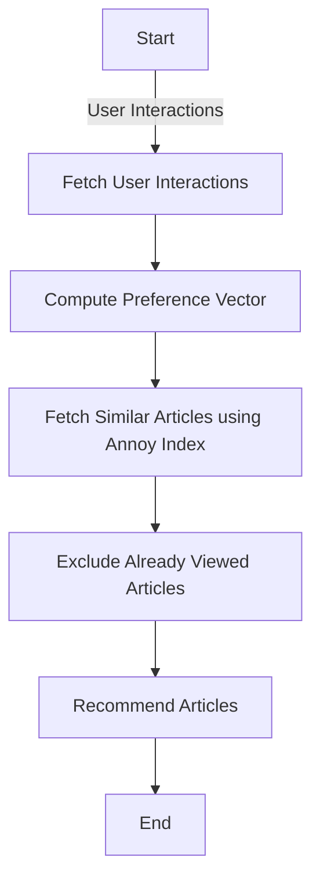
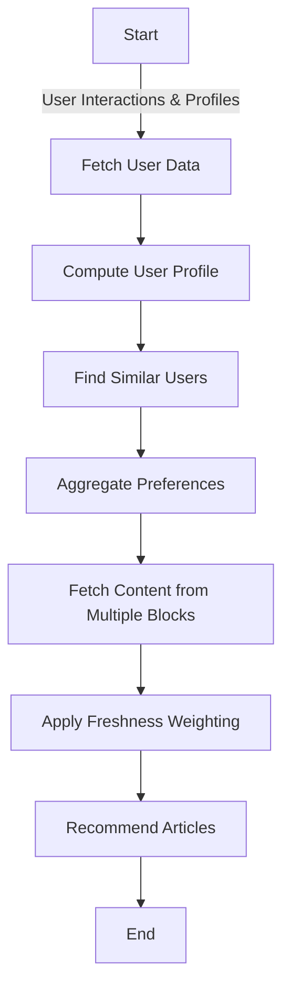

# Article Recommendation System Enhancement - Cafeyn

## Introduction

As a Data Scientist at a fast-growing company, I was tasked with expanding the Explore page by introducing a new content block based on a novel article recommendation strategy. The goal was to improve user engagement by providing personalized article suggestions that align with user behaviors, interests, and emerging trends.

*Note*: This is a mockup structure that has only one user for the sake of simplicity.

## Table of Contents

- [Objective](#objective)
- [Setup](#setup)
- [Methodology](#methodology)
  - [1. Strategy Identification](#1-strategy-identification)
  - [2. Data Collection and Preprocessing](#2-data-collection-and-preprocessing)
  - [3. Feature Extraction with Sentence Embeddings](#3-feature-extraction-with-sentence-embeddings)
  - [4. Indexing with Annoy for Efficient Similarity Search](#4-indexing-with-annoy-for-efficient-similarity-search)
  - [5. Database Integration](#5-database-integration)
  - [6. User Interaction Tracking](#6-user-interaction-tracking)
  - [7. Recommendation Engine Development](#7-recommendation-engine-development)
    - [Current Recommendation Logic](#current-recommendation-logic)
  - [8. Handling Data Type Issues](#8-handling-data-type-issues)
  - [9. Error Handling and Logging](#9-error-handling-and-logging)
  - [10. Testing and Refinement](#10-testing-and-refinement)
- [Results](#results)
- [Experiments and Analysis](#experiments-and-analysis)
  - [Analysis Objectives](#analysis-objectives)
  - [Experiment Design](#experiment-design)
    - [Experiment 1: A/B Testing of Content Strategies](#experiment-1-ab-testing-of-content-strategies)
    - [Experiment 2: User Behavior Analysis](#experiment-2-user-behavior-analysis)
    - [Experiment 3: Personalization Algorithm Evaluation](#experiment-3-personalization-algorithm-evaluation)
  - [Data Collection and Metrics](#data-collection-and-metrics)
  - [Expected Outcomes](#expected-outcomes)
- [Next Steps](#next-steps)
  - [Extending to Multiple Content Blocks](#extending-to-multiple-content-blocks)
  - [Freshness of Articles](#freshness-of-articles)
  - [Future Recommendation Logic](#future-recommendation-logic)
  - [Scalability and Performance](#scalability-and-performance)
- [Conclusion](#conclusion)

## Objective

- **Identify a new strategy for article recommendations** targeting specific user behaviors, interests, or emerging trends.
- **Design and develop a new machine learning (ML) model** focused on user interaction patterns and article content.
- **Document each step** required to create and implement this model.

## Setup

To start the web application, follow these steps:

1. **Run the Notebook**:

   - Open the Jupyter notebook provided in the project repository.
   - Run all cells to process and ingest the data.
   - This step will create the necessary tables and read in the Articles. csv dataset from kaggle.

2. **Run the Ingestion Script**:

   - Execute the data ingestion script to populate the SQLite database (`database/rss_feed.db`).
   - The script will extract articles from the newsapi and store them in the database.
   - This step will generate the embeddings and build the Annoy index (`database/article_vector.index`).

3. **Run the Application**:

   - Run the `main.py` file to start the Flask web application.
     ```bash
     python main.py
     ```
   - The application will use the populated database and the Annoy index for recommendations.

**Note**: Since the database and the Annoy index are already provided in the repository, you can directly run the `main.py` file to start the application without re-running the data processing steps.

## Methodology

### 1. Strategy Identification

To create a more personalized user experience, I decided to implement a **content-based recommendation system** enhanced by user interaction data. The strategy involves:

- **Analyzing article content** to understand topics and themes.
- **Tracking user interactions** (e.g., views, likes, dislikes) to capture preferences.
- **Combining content analysis with user behavior** to generate tailored article recommendations.

### 2. Data Collection and Preprocessing

- **Article Dataset**: Collected over 2,700 articles from RSS feeds and a custom CSV file containing news articles.
- **Content Extraction**: Extracted key fields such as title, description, content, category, and published date.
- **Text Preprocessing**: Combined title, description, and content into a unified text field for each article.

### 3. Feature Extraction with Sentence Embeddings

- **Model Selection**: Used the `SentenceTransformer` library with the `'all-MiniLM-L6-v2'` pre-trained model to generate embeddings.
- **Embedding Generation**: Converted the unified text of each article into a numerical vector representing its semantic content.

### 4. Indexing with Annoy for Efficient Similarity Search

- **Annoy Index Creation**: Built an Annoy index using the generated embeddings to facilitate fast nearest-neighbor searches.
- **Index Parameters**: Set the number of trees to 10 for a balance between search speed and accuracy.

### 5. Database Integration

- **SQLite Database**: Stored articles in a SQLite database (`rss_feed.db`) with a schema accommodating all necessary fields.
- **Data Insertion**: Inserted articles into the database, ensuring no duplicates by enforcing a unique constraint on title and published date.

### 6. User Interaction Tracking

- **Interaction Logging**: Created a `user_interactions` table to log actions such as `view`, `thumbs_up`, `thumbs_down`, `next`, and `back`.
- **Session Management**: Used Flask sessions to track user history and interactions during their visit.

### 7. Recommendation Engine Development

#### Current Recommendation Logic

The current recommendation logic can be visualized as follows:



#### Preference Vector Calculation:

 - **Positive Interactions**: Considered thumbs_up and back actions as positive feedback.
- **Negative Interactions**: Considered thumbs_down as negative feedback.
- **Preference Vector**: Calculated as the mean of embeddings from positively interacted articles.

#### Similar Article Retrieval:

- Used the Annoy index to find articles similar to the preference vector.
- Excluded articles the user had already interacted with to avoid repetition.

#### Fallback Mechanism:

- If no similar articles were found, the system fetched random articles excluding those disliked or already viewed.

### 8. Handling Data Type Issues

#### Data Type Consistency:

- Ensured all article_id values were standard Python integers.
- Converted NumPy integer types to Python integers before database queries to avoid mismatches.

### 9. Error Handling and Logging

#### Logging Configuration:

- Used the logging module to capture debug information.
- Configured logging to output at the DEBUG level for detailed traceability.
#### Exception Management:

- Added try-except blocks to handle potential exceptions gracefully.
- Logged exceptions with stack traces for easier debugging.

### 10. Testing and Refinement

#### Test Scenarios:

- Tested the system with various user interaction patterns, including cases with no interactions, only positive interactions, and only negative interactions.

#### Issue Resolution:

- Identified and fixed issues related to data type mismatches and exclusion logic.
- Improved the recommendation logic to handle edge cases effectively.

## Experiments and Analysis

### Analysis Objectives

With three content strategies available for the Explore page, the objective is to determine how to make the Explore page most relevant for each individual user. This involves:

- **Understanding User Preferences**: Analyzing how different users interact with various content strategies.
- **Optimizing Content Delivery**: Identifying which content strategy or combination thereof maximizes user engagement.
- **Personalization**: Tailoring the Explore page to individual user behaviors and interests.

### Experiment Design

To gain these insights, I propose the following experiments:

#### Experiment 1: A/B Testing of Content Strategies

- **Purpose**: To evaluate the effectiveness of each content strategy in isolation and in combination.
- **Method**:
  - **User Segmentation**: Randomly divide users into different groups.
    - **Group A**: Users see Content Strategy 1.
    - **Group B**: Users see Content Strategy 2.
    - **Group C**: Users see Content Strategy 3.
    - **Group D**: Users see a combination of all three strategies.
  - **Duration**: Run the experiment for a sufficient period to collect meaningful data (e.g., 2 weeks).
- **Analysis**:
  - Compare engagement metrics across groups (e.g., click-through rate, time spent, number of articles read).
  - Identify which strategy or combination yields the highest engagement.

#### Experiment 2: User Behavior Analysis

- **Purpose**: To understand how different user segments interact with content strategies.
- **Method**:
  - **Data Collection**: Gather detailed interaction data (likes, dislikes, dwell time) for each user.
  - **User Profiling**: Categorize users based on demographics, behavior patterns, or interests.
- **Analysis**:
  - Use clustering algorithms to identify user segments.
  - Analyze content preferences within each segment.
  - Determine if certain strategies are more effective for specific user groups.

#### Experiment 3: Personalization Algorithm Evaluation

- **Purpose**: To assess the performance of the personalized recommendation algorithm versus non-personalized content.
- **Method**:
  - **Controlled Experiment**: Compare users receiving personalized recommendations to those receiving generic, non-personalized content.
  - **Metrics**: Measure engagement, satisfaction (through surveys), and retention rates.
- **Analysis**:
  - Evaluate whether personalization leads to significant improvements in user engagement.
  - Identify any potential biases or issues in the recommendation algorithm.

### Data Collection and Metrics

- **Data to Collect**:
  - User interactions (clicks, likes, dislikes, shares).
  - Session duration and time spent on articles.
  - Bounce rates and exit pages.
  - Demographic data (where available and compliant with privacy policies).

- **Key Metrics**:
  - **Engagement Metrics**: Click-through rate (CTR), average session duration, pages per session.
  - **Conversion Metrics**: Subscription sign-ups, content shares.
  - **Satisfaction Metrics**: User feedback scores, survey results.
  - **Retention Metrics**: Return visits, active user rates over time.

### Expected Outcomes

- **Identification of Optimal Content Strategy**:
  - Determine which content strategy or combination maximizes user engagement and satisfaction.

- **Enhanced Personalization**:
  - Gain insights into user preferences to refine the recommendation algorithms.

- **User Segmentation Insights**:
  - Understand how different user groups interact with content, enabling targeted strategies.

- **Algorithm Performance Validation**:
  - Validate the effectiveness of the personalization algorithm and identify areas for improvement.

## Next Steps

### Extending to Multiple Content Blocks

#### Integration of Diverse Content Blocks

- Extend the recommendation logic to handle multiple types of content blocks (e.g., videos, podcasts, user-generated content).
- Collect data on user interactions with various combinations of content blocks to understand cross-content preferences.

#### User Data and Similarity Function

- Incorporate additional user data (demographics, browsing history, social connections) to create comprehensive user profiles.
- Develop a user similarity function to leverage the preferences of similar users.
- Implement collaborative filtering techniques alongside content-based filtering to enhance recommendations.

### Freshness of Articles

- Introduce a mechanism to prioritize newer articles in recommendations.
- Apply a decay function to reduce the relevance of older articles over time.
- Combine freshness scores with content similarity to provide timely and relevant recommendations.

### Future Recommendation Logic

The future recommendation logic incorporating these enhancements can be visualized as follows:


### Scalability and Performance

#### Optimizations:

- Enhance the Annoy index by increasing the number of trees or exploring alternative similarity search algorithms like FAISS.
- Implement caching mechanisms and asynchronous processing to improve response times.

#### User Segmentation:

- Segment users based on behavior, interests, and demographics to provide more targeted recommendations.
- Use machine learning clustering algorithms to identify user segments.

#### A/B Testing and Metrics:

- Set up A/B testing frameworks to evaluate the performance of different recommendation strategies.
- Define and monitor key metrics such as click-through rate, time spent on page, and user retention to measure effectiveness.

### Conclusion

The project successfully expanded the Explore page with a new content block that delivers personalized article recommendations. By integrating content-based filtering with user interaction data, the system aligns closely with user interests and behaviors. The experiments and analysis outlined provide a roadmap for optimizing the Explore page's relevance to individual users. The documented methodology and proposed experiments lay the groundwork for future enhancements, such as incorporating advanced user profiling, collaborative filtering techniques, and real-time personalization.
